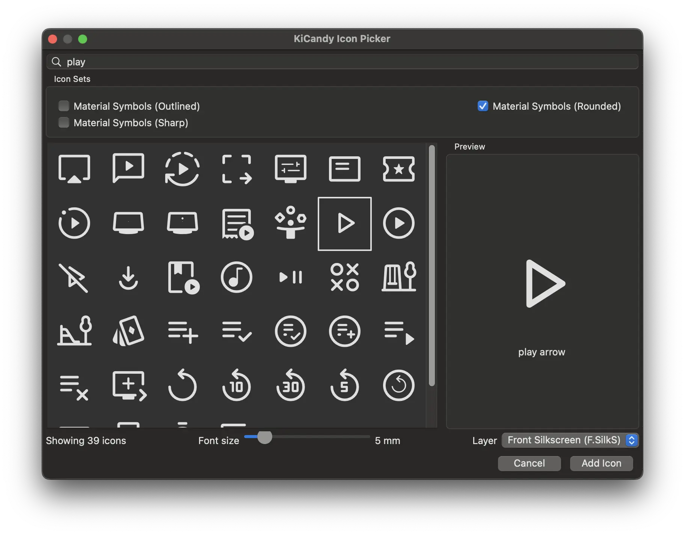

# KiCandy Icon Picker

KiCandy is a KiCad 9 Python action plugin that inserts Material Symbols glyphs as
free silkscreen text. Instead of typing a Unicode character manually, you get a
searchable gallery of icons grouped by font style (Outlined, Rounded, Sharp).

## Features

- Search-as-you-type filtering with live updates as you toggle icon sets.
- Persistent dialog state so the plugin remembers the last search text, enabled
  icon sets, and chosen layer.

## Usage

1. Load a PCB in KiCad 9 and run the **Insert Icon Text** action.
2. Type to search or toggle the icon family checkboxes. The list updates as you
   type; enabling at least one font is required.
3. Select the target silkscreen layer, highlight an icon, and press **Add Icon**
   (or double-click the row).
4. A `BoardText` item containing the glyph is created and pushed into an
   interactive move session so you can place it immediately.

### Notes

- Only tested on macOS so far.
- The dialog only offers icon sets that are installed on the host OS and have
  cached codepoint metadata. Install the desired fonts (Material Symbols,
  Material Design Icons, Remix Icon, …) before launching KiCandy; the plugin
  copies codepoints into its cache automatically.

  Download Material Symbols TTFs from
  https://github.com/google/material-design-icons/tree/master/variablefont and
  install them using *Font Book* (macOS) or by copying into
  `%LocalAppData%\Microsoft\Windows\Fonts` and adding the matching registry
  entries.
- Codepoint files are cached under `cache/` within the plugin directory. Delete
  the folder if you need to force a refresh.
- Dialog state is stored in `cache/kicandy_state.json` (or the KiCad plugin
  cache directory when `KICAD_CACHE_HOME` is set).
- wxPython version during development: 4.2.2a1 osx-cocoa (phoenix) wxWidgets 3.2.8

### Profiling

- Add `pyinstrument>=5.1.1` to `requirements.txt` (for KiCad to pick it up) to
  enable the optional startup profiler.
- When present, invoking the plugin writes PyInstrument output to
  `/tmp/kicandy_profile.txt` (text) and `/tmp/kicandy_profile.html` (HTML) after
  the dialog closes, making it easy to analyze slow launches.

## Extending

Icon fonts are defined via `IconFontSource` subclasses in `icon_fonts.py`. Each
source provides metadata for one family (with optional styles), a
`download_codepoints` implementation, and inherits the built-in TTF installer
logic. Append new sources to `ICON_FONT_SOURCES` and KiCandy will offer them as
soon as wxPython can see the font family and the codepoints can be cached.
